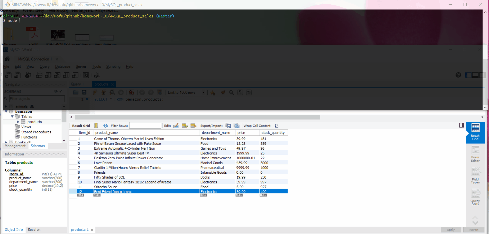

# MySQL_product_sales

## App Demo GIF

Watch the demo for all the details about what the input and output screens look like. Screenshots are provided below to show major functionalities.

### Description
This assignment creates a database containing inventory that can be added, "purchased", or just displayed, via a combination of node, inquirer, and mysql.

There are two javascript files to execute via node:
* bamazonCustomer.js
* bamazonManager.js

Before anything can be run in this repo, you have to make sure you have both inquirer and mysql installed.
Run **npm install** to get those installed.

Start the files in terminal/gitbash by typing:
* **node bamazonCustomer.js**
* **node bamazonManager.js**

First part of the Customer Bamazon javascript has you select one of the shoppable items on a list provided to your terminal. THe list contains information of each item, from their id and name to the price. Select an Item Id based on that list to initiate a purchase.

After selecting an item to purchase, you will be prompted to indicate how many of said items you would like to buy. Again, enter in an amount. After pressing enter, you will be notified the total purchase amount, or that there is insufficient stock baesd on what you tried to purchase.

For the second file, you're prompted to select one of four choices as the manager of Bamazon. 

The first choice provides a list similar to the initial list the customer receives upon running the Customer file, but it also contains the stock amount. 

The last choice choice is if the manager needs to add a new inventory into stock. Selecting this option will prompt the manager/user to enter in the required properties of the item.

View Low Inventory option gives the user/manager a list of items that have less than 5 items in stock. Ideally, this is run periodically to determine if new inventory needs to be added to any items. 

Finally, if stock is low for an item (or if you just feel like it), you can select Add Inventory to add more stock to an existing item. Select the Item ID and the amount of stock to add.